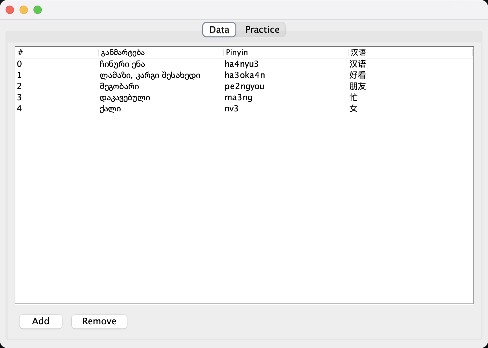
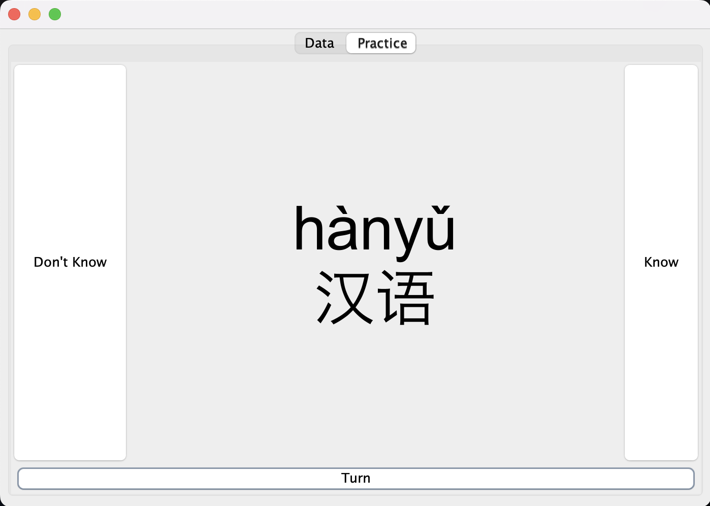

# Chinese Flashcards

This is the first Java program I created with Swing. I learned how to use the MVC design pattern while working on it,
and the software itself helped me learn during the Chinese course. There are two views for this program, "Data" and "Practice". 
Data view allows the user to add custom words to the database, change or remove them. Practice view shows user all these flashards created 
from these words in random order, until the user correctly answers all of them, after which the program exits.

  
  

## Installation

Program needs [Java (JRE)](https://www.java.com/en/download/) to run, no extra installation step is needed. Program release comes with the `res` folder, which contains `data.json`,
 which is a crucial file and program won't run without this. This file contains all the flashcard data the user has. To run the actual program,
  open the `chinese.jar` file from the root of release directory.

## Usage

### Practice View
If you want to use just the practice view, then you must open the practice tab, and take a guess about the chinese pronounciation and writing of the presented word. You can turn the card to reveal the answer when you are ready. After this, click "Don't Know" if you didn't know an answer or "Know" if you did. The program will always show you the next unanswered question until you answer "Know" on all of them, after which the program exits.

### Data View
If you want to add your own data to the program, you must open the data tab. From there, you can click on a row to edit it, or you can add/remove rows with the presented buttons. `განმარტება` column contains translation for the Chinese word/phrase, `Pinyin` for Pinyin pronounciation and `汉字` for corresponding hieroglyphs. To write tones in Pinyin, you must write 1, 2, 3 or 4 after the wovel. If you want to get the **"ü"** character, use the letter **"v"**. There are examples given in the "Data View" screenshot above.

## License
While no future development is scheduled, the project remains open-source under the [MIT License](LICENSE), allowing users to modify, distribute, and use the code in their own projects. You are encouraged to explore the codebase and contribute to it.
